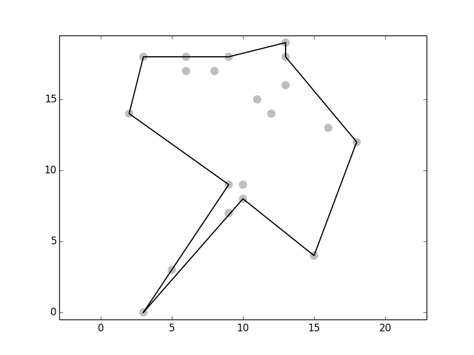

# concavehull

Computes the envelope of a set of points, which represents the area occupied by
this points. A nearest neighbours approach is used to generate a concave or convex
hull.

This is based on the works of Moreira and Santos 2007.

## References
Adriano Moreira and Maribel Yasmina Santos (2007): CONCAVE HULL: A K-NEAREST NEIGHBOURS APPROACH FOR THE COMPUTATION OF THE REGION OCCUPIED BY A SET OF POINTS. GRAPP 2007 - International Conference on Computer Graphics Theory and Applications, pp. 61-68
[moreira_and_santos_2007](http://repositorium.sdum.uminho.pt/bitstream/1822/6429/1/ConcaveHull_ACM_MYS.pdf)
